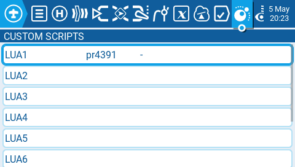
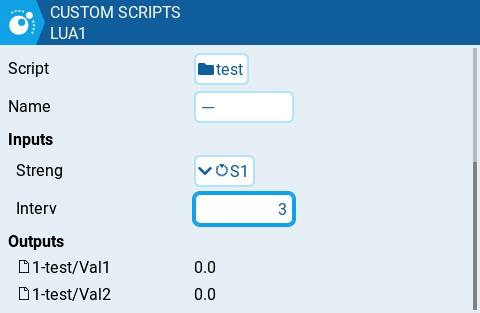

# Custom Scripts

<figure><figcaption>
Custom Mixer Scripts
</figcaption></figure>

Custom (Mixes) Scripts take one or more values as inputs, do some processing in Lua code, and output one or more values. Each model can have several Mixes Scripts associated with it, and these scripts are run periodically. They behave similarly to standard EdgeTX mixers, but at the same time they provide a much more flexible and powerful tool.

Typical use cases:

* replacement for complex mixes that are _not critical_ to model function
* complex processing of inputs and reaction to their current state and/or their history
* filtering of telemetry values


If the script output is used as a `mixer source` , and the **script is killed** for whatever reason, then _the_ **whole mixer line is disabled**! Exercise caution when using them for primary controls. It is advisable to have a fallback mixer line, that will be used if for whatever reason the Mixer Script is terminated.


<figure><figcaption>
Inputs and Outputs for Mixer Scripts
</figcaption></figure>

Here is an example of mixer script that accepts a source and constant value, and has two outputs that will be selectable in the mixer as sources.&#x20;
