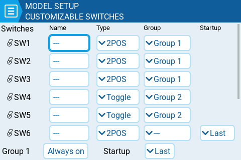
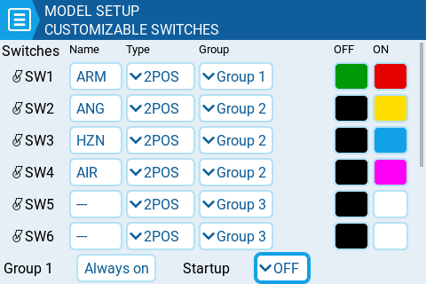

# Customizable Switches

A traditional 6 position switch/control is either a group of 6 switches that work together (where only one can be active at one time) or a single rotary switch that has six physical positions (detents).  Some newer generation radios provide the "Customizable Switch" capability, which allows you to define type, grouping and startup state of the switches. Physically, they look like a regular 6 position switch which you will see on older handset designs, but they are much, _**much**_, more flexible.


If you do need the customizable switches to behave **exactly** like the traditional 6POS switch, you need to configure six customisable switches to be in a single group, set that group to be "Always On", and Startup for the group set to the first switch. You will then be able to use, for example, GR1 in place of 6POS.&#x20;


<figure><figcaption>
Example of Customizable Switch options on one supported handset.
</figcaption></figure>

**Name:** Whichever three letter name you wish to give each customisable switch.

**Type:** Can be set to any of the following

* **None** : basically disabled
* **Toggle** : customizable switch is only "active" while being pushed
* **2POS** : pushing the switch will alternate it's state. i.e. OFF push ON push OFF ....

**Group:** This is where you choose how the individual switches should be grouped. You can choose for them to be in a single group (the default, Group 1), and then they can be used like a traditional 6POS switch. Or, you can define them to be in seperate groups (e.g. as shown for SW1-SW3 and SW4-SW5 above), or even for some switches to not be in a group at all (e.g. SW6 as shown above). \
\
You can use the various groups as a source for inputs or mixes via the GR# option, where the # represents the number of the group (e.g. GR1, GR2).&#x20;

When switches are grouped, only one switch in the group can be active at a time. Additionally, you can specify that one switch in the group must always be on **"Always on"**.&#x20;

**Startup:** Here is where you specify the startup state for either a 2POS customizable switch not in a group, or for a group of customizable switches. You can specify it to be "Last" (remember the last state when the transmitter was powered off or model changed) or in the up (released) or down (pressed) state.&#x20;

**OFF / ON Colors (on compatible handsets):** Some handsets support configuring the color of the customizable switches. If so, the OFF and ON color pickers will be shown for each customisable switch (as shown below) and you will be able to pick your preferred colour for each state. Black represents when the customizable switch is not illuminated.  \

<figure><figcaption>
Customizable Switch options on a handset that also supports configuring the LED colors
</figcaption></figure>
