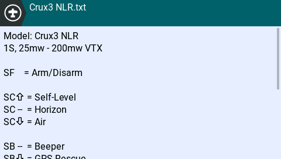
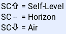
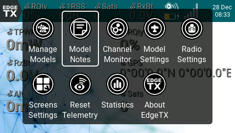
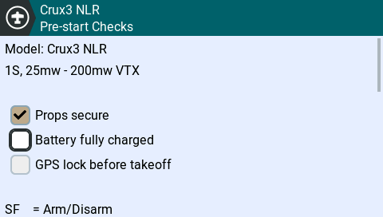

# Model Notes and Checklists

<div><figure><figcaption></figcaption></figure> <figure><figcaption></figcaption></figure></div>

As you start using more complex models, or retire some models to only fly infrequently, remembering how you have the various switches and controls configured, or certain peculiarities to the startup or setup of a craft can start to be a challenge. This is where Model Notes can come in handy.\
\
Model Notes have three general modes of operation:

1. On-demand notes (meaning you need to bring them up when you want to view them)
2. Displayed whenever you switch to the model (i.e. as a checklist)
3. As an interactive checklist (requiring you to tick each of the items off before you can start using the model)


Using Model Notes as a checklist or interactive checklist does not prevent you from also displaying them on-demand. You can use them as a combiniation of checklist and additional notes as needed.


To get started with model notes, you need to create a text file in the `\MODELS` folder of your radio handset's SD/Storage drive. It should have the exact same name as the model you wish to use it for, and the file name/extension should end with `.txt`. Spaces in the model name should be replaced with underscores. For example, the model name "Crux3 NLR" would become `Crux3_NLR.txt`&#x20;


Due to the length of these files, you can not create or edit them on the radio handset, only view them. As they are basic text files, they can be created and edited on any computer using a standard text editor, as well as via EdgeTX Companion.


## Formatting

Model notes files are simply text files, with no special formatting or software needed to view or edit them. However, there are some special sequences you can use to display switch arrows, other special icons used through EdgeTX, and to designate lines as being checklist items.&#x20;


One difference between color and B\&W screen handsets to note is how long lines are handled. Color screens will "wrap" long lines so they don't get truncated. B\&W screens will truncate long lines. Thus you need to ensure you manually limit the length of the liens so they don't end up "off screen" and unreadable.


### Switch symbols

When you are writing your notes you might want to reference switch positions, there are some special text sequences you can use to show arrows such as the switch up and down arrows.

* `\up` will give you the switch up arrow
* `\dn` will give you the switch down arrow

\
Thus, you can write things like:

```
SC\up = Self-Level
SC --  = Horizon
SC\dn = Air
```

Which will be displayed on the transmitter display as:

<figure><figcaption><p>Color display example</p></figcaption></figure>


Character alignment is different on color and black and white displays... the `\up` and `\dn` symbols only take up one character space on black and white displays, thus `-` is the same size as the arrows.


Thus, the corresponding formatting for black and white displays is:

```
SC\up = Self-Level
SC- = Horizon
SC\dn = Air
```

<figure><figcaption><p>Black and White display example</p></figcaption></figure>

### Interactive Checklist Items

When using interactive checklists, to designate a line as being a checklist item (thus requiring a checkbox to be displayed and ticked off), simply start the line with an equals symbol.

```
This line will not be a checklist item
=Props secure
=Battery fully charged
=GPS lock before takeoff 
```

<div><figure><figcaption></figcaption></figure> <figure><figcaption></figcaption></figure></div>

### Other Symbols

You can also access other symbols, such as those used to indicate inputs, mixes, special functions, global variables, etc, by using the `\` escape character, and a number between 200 and 255. \
\
For example, the following codes in model notes will result in the below output on color screen:

```
200\200
201\201

210\210
211\211
212\212
213\213
214\214
215\215
```

<figure><figcaption><p>As shown on color display. The leading numbers are only for reference. </p></figcaption></figure>

## Usage

As mentioned in the beginning, there are three general modes of operation, as follows.&#x20;

### On Demand Model Notes

When detected, model notes can be selected via the Quick Menu / Main Menu on color screen transmitter handsets, and via the popup menu on B\&W screen radios (long press enter to show this). \
<br>

<figure><figcaption><p>Model Notes entry in color display Quick Menu</p></figcaption></figure>

<figure><figcaption><p>Model Notes entry on Black and White display</p></figcaption></figure>

### Checklist

Once you have enabled the Checklist item under Pre Start Checks (for [color,](../color-radios/model-settings/model-setup/preflight-checks.md) for [B\&W](../bw-radios/model-select/setup.md#pre-start-checks)), whenever you select that model (either when switching to it, or on power on), the notes will be displayed, and can be scrolled/dismissed once you are ready to continue. Unlike the interactive checklist, you are not required to tick off the checklist items (and they will not be shown as tickable items). Consider this more of a "show model notes on startup" option.&#x20;

### Interactive Checklist

Once you have also enabled the Interactive option under the Pre Start Checks (for [color,](../color-radios/model-settings/model-setup/preflight-checks.md) for [B\&W](../bw-radios/model-select/setup.md#pre-start-checks)), when you have a correctly formatted model notes file, the model notes will be displayed, and you will be required to tick off all the checklist items before you can continue to use the model. The screen will automatically scroll as necessary to jump to the next item that needs to be checked, allowing you to mix explanatory notes and checklist items. Once all items are complete, it will jump to the bottom of the checklist, at which point you can then exit. \
<br>

<figure><figcaption><p>Interactive checklist on color screen</p></figcaption></figure>

<figure><figcaption><p>Interactive checklist on B&#x26;W screen</p></figcaption></figure>


